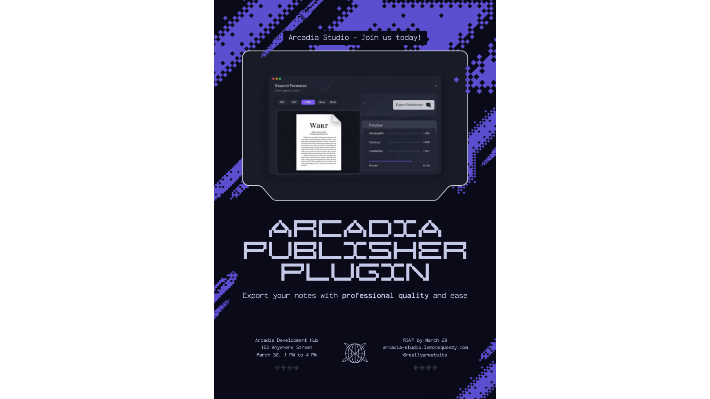

# Arcadia Publisher

Export Obsidian notes to PDF and HTML with professional formatting, configurable templates, and one-click output from the ribbon or command palette.

> Desktop only.

## Features

### Free
- PDF export of the active note with clean print-ready formatting
- HTML export as a self-contained file with embedded styles
- Basic built-in templates for general documents
- Export modal with format selection and output path control
- Ribbon icon and dedicated commands for fast access

### Premium
- Word (.docx) export for Microsoft Office and Google Docs compatibility
- EPUB export for e-reader distribution
- LaTeX export for academic typesetting workflows
- Custom template editor for full control over output styling
- Batch export of multiple notes or entire folders
- Citation formatting in Chicago, APA, and MLA styles
- Get Premium at [arcadia-studio.lemonsqueezy.com](https://arcadia-studio.lemonsqueezy.com)

## Installation

1. Open Obsidian Settings
2. Go to Community Plugins and disable Safe Mode
3. Click Browse and search for "Arcadia Publisher"
4. Install and enable the plugin

## Manual Installation

1. Download the latest release from [GitHub Releases](https://github.com/Arcadia-Studio/obsidian-arcadia-publisher/releases)
2. Extract to your vault's `.obsidian/plugins/arcadia-publisher/` folder
3. Reload Obsidian and enable the plugin

## Usage

With a Markdown note open, click the ribbon icon (file-output) or run one of these commands from the command palette:

- **Export current note to PDF** - exports directly with current settings
- **Export current note to HTML** - exports directly with current settings
- **Export current note...** - opens the export modal to choose format and options

The export modal lets you select the output format, template, and destination folder before exporting.

## Premium License

Arcadia Publisher uses a freemium model. Core features are free. Premium features require a license key from [Lemon Squeezy](https://arcadia-studio.lemonsqueezy.com).

To activate: Settings > Arcadia Publisher > Enter License Key

## About Arcadia Studio

Arcadia Studio builds productivity tools for Obsidian users. [arcadia-studio.lemonsqueezy.com](https://arcadia-studio.lemonsqueezy.com)
